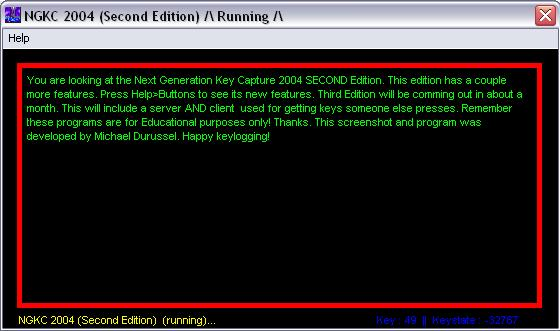



## KeyCapture Second Edition

### Description

Next Generation Key Catch 2004 SECOND Edition has 3 new features. You can now press F keys to do certain functions. There is also an F key to hide/show from ctrl, alt, del and from system proccesses. Third Edition will have a server/client for getting keys pressed on a remote computer. Happy keylogging!
 
### More Info
 

             |
---                |---
**Submitted On**   |2002-10-06 22:25:28
**By**             |[Michael Du Russel](https://github.com/Planet-Source-Code/PSCIndex/blob/master/ByAuthor/michael-du-russel.md)
**Level**          |Intermediate
**User Rating**    |5.0 (25 globes from 5 users)
**Compatibility**  |VB 5\.0, VB 6\.0
**Category**       |[Files/ File Controls/ Input/ Output](https://github.com/Planet-Source-Code/PSCIndex/blob/master/ByCategory/files-file-controls-input-output__1-3.md)
**World**          |[Visual Basic](https://github.com/Planet-Source-Code/PSCIndex/blob/master/ByWorld/visual-basic.md)
**Archive File**   |[KeyCapture1416751062002\.zip](https://github.com/Planet-Source-Code/michael-du-russel-keycapture-second-edition__1-39600/archive/master.zip)

